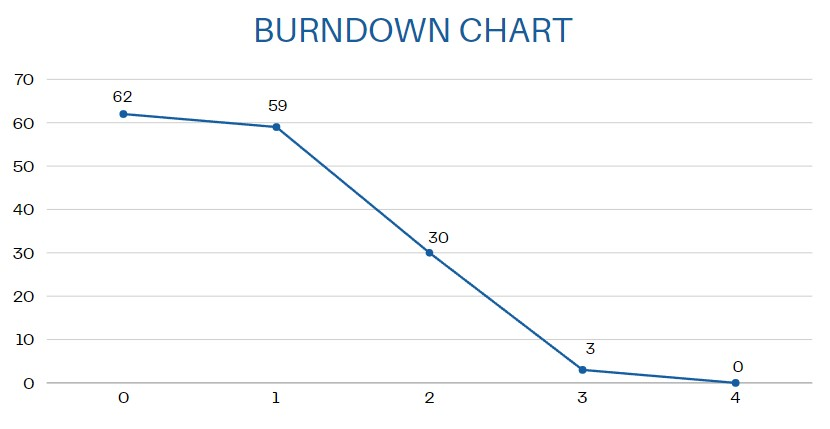

# Pencaverso App

- Universidad ORT Uruguay
- Ingeniería de Software Ágil 1 - 2024
- Tutores: Andres Galiana, Florencia Clerici
- Integrantes: Bruno Quadrelli, Franco Ribarov, Santiago Chemello, Yoana Aristimuño, Juan Foti, Ignacio Santalla

## Introducción

Este informe académico tiene el objetivo de presentar los resultados obtenidos al aplicar prácticas ágiles en ingeniería de software y reflexiona sobre las lecciones aprendidas durante el proceso. En particular, se enfoca en la utilización del marco de trabajo Scrum para el desarrollo de una aplicación de pencas con diversas funcionalidades.

## Reflexión general

El objetivo del proyecto fue aprender prácticas de gestión ágil mediante su aplicación al descubrir, idear y prototipar una aplicación de pencas que permita diversas funcionalidades.

El tamaño del proyecto es de 62 Story Poitns (SP) y tuvo una duración de 4 iteraciones de 2 semanas de duración cada una. La capacidad planificada es de 5 hs-persona por Sprint.
Realizamos seguimiento de las iteraciones mediante Daily Scrums, Sprints Reviews, Sprints Retrospective y Registro de Horas.

| Sprint | SP Completos |
| ------ | ------------ |
| 1      | 3            |
| 2      | 29           |
| 3      | 27           |
| 4      | 3            |
| TOTAL: | 62           |

Para el proyecto se siguió el marco de trabajo Scrum, el mismo es una metodología ágil utilizada para le gestión de proyectos. Este marco de trabajo tiene ciertas ceremonias y artefactos, que fueron seguidas por el equipo para cumplir con esta metodología, las cuales serán detalladas más adelante.

A continuación dejamos la burndown chart de la release 1.

# Scrum

En las primeras iteraciones, aplicar este marco de trabajo no fue tan sencillo ni tan fructífero como en las últimas iteraciones, ya que no todos los integrantes del equipo tenían experiencia utilizando Scrum, sin embargo, con a medida que avanzaban las iteraciones, la comunicación del equipo y la correcta utilización de los artefactos como el Sprint Review, Sprint Retrospective y el feedback de las iteraciones se pudo comprender esta metodología aplicándola en la práctica de forma satisfactoria. Esto se puede ver claramente, en la disminución de la cantidad de Dailys Scrum entre la iteración 2 y 3.

## Roles

El Scrum Team para el proyecto estuvo compuesto por 6 personas, siendo lo suficientemente pequeño como para ser ágil y lo suficientemente grande como para completar un trabajo significativo dentro de un Sprint.

Para este marco de trabajo se tienen definidos 3 roles:

- Scrum Master: es la persona encargada de ayudar al equipo a mejorar las prácticas y la efectividad durante los distintos Sprints, asegurándose de que se siga el marco de esta metodología correctamente para agregarle valor al sprint. Yoana Aristimuño tomó este rol durante todas las iteraciones.
- Product Owner: es la persona encargada de maximizar el valor del producto resultado del trabajo del Scrum Team, asegurándose de que el Product Backlog sea transparente, visible y comprensible. Juan Foti tomó este rol durante todas las iteraciones.
- Desarrolladores: son las personas encargadas de crear el producto. Para este proyecto, el producto a desarrollar fue un prototipo en Figma. Los roles de desarrolladores fueron tomados por: Santiago Chemello, Bruno Quadrelli, Franco Ribarov e Ignacio Santalla.

## Seguimiento de las iteraciones

En el transcurso de las iteraciones se realizaron todos los artefactos sugeridos por el marco de trabajo Scrum, los cuales facilitaron en gran medida la planificación, coordinación y evaluación del trabajo.

## Daily Scrum

Estas son reuniones breves de no más de 15 minutos, en las cuales el Scrum Team se pone al día sobre la situación en la que están respecto al desarrollo del producto y adaptan lo necesario para poder completar el trabajo. Estas se realizaron en Microsoft Teams. El objetivo de estas reuniones es responder las preguntas ¿Qué hice ayer? ¿Qué voy a hacer? ¿Algún bloqueante? Dado que nuestro proyecto no tuvo Dailys Scrum todos los días debido al tipo de desarrollo del mismo se cambió la primera pregunta por ¿En qué avancé desde la última Daily?

Estas reuniones nos permitieron mantener una sincronización entre el Scrum Team, para poder cumplir el objetivo del Sprint en cada iteración, ya que nos permite saber a todos el estado de cada tarea de cada uno y en caso de precisar ayuda, se organiza otra reunión luego para brindarla.

## Sprint Planning

Estas reuniones sucedieron al principio de cada Sprint y tuvieron el objetivo de responder las preguntas ¿Por qué es valioso este Sprint? ¿Qué se puede hacer en este Sprint?
En cada Sprint Planning, el Product Owner indicaba los elementos del Product Backlog que le parecían pertinentes para cumplir con los objetivos de ese Sprint, luego los desarrollares se encargaban de discutir si se podría o no cumplir con esos ítems del Product Backlog para esa iteración.

Luego de finalizada la Sprint Planning, se tenía un Product Backlog con el cual los desarrolladores trabajaran durante esa iteración.

## Sprint Review

Estas reuniones fueron realizadas próximas a finalizar el sprint, su objetivo es determinar el resultado del trabajo realizado en el Sprint con el Product Owner, para poder determinar futuros cambios que debería hacerse el producto, en las próximas iteraciones.

Además, de forma asíncrona realizamos encuestas mediante Google Forms, en las cuales realizamos validación con futuros interesados en el producto, estos son conocidos del equipo que se encuentran en el rango de edades establecido para el proyecto y que serían posibles futuros usuarios de la aplicación, grandes aficionados del deporte, que a su vez cumplen con el perfil de persona competidora la cual le gustaría conocer si acertó más resultados que otra persona.

Google Forms tiene una funcionalidad en la cual se pueden ver gráficos sobre las múltiples respuestas de los usuarios, esto nos permitió entender de manera visual que necesitábamos mejorar. Además, la encuesta tenía una sección en la cual los interesados podían sugerir cambios, estos fueron implementados en el tercer Sprint.

## Sprint Retrospective

El objetivo de estas reuniones es evaluar el desarrollo del Sprint, con el propósito de analizar el rendimiento del equipo durante el mismo para evaluar formas de aumentar la calidad y la efectividad para los próximos Sprints.
Nos planteábamos las preguntas ¿Qué salió bien en el Sprint? ¿Qué podría haber salido mejor? ¿Con que nos comprometemos a mejorar para el próximo Sprint? Estas eran instancias de autocrítica fueron muy positivas, ya que nos permitieron mejorar como equipo, identificando las fallas juntos.

### Herramientas utilizadas

## Azure DevOps

Esta herramienta potenció nuestro trabajo siguiendo el marco de trabajo de Scrum. En la misma, creamos un nuevo proyecto y configuramos un entorno de trabajo basado en el marco de Scrum que nos permitió administrar sencillamente las Épicas, Historias de Usuario y Tareas, en los tableros del proyecto y del Sprint.
El Product Backlog se diseñó como una lista emergente y ordenada de lo que se necesita para mejorar el producto. Aquí, el Objetivo del Producto es gestionar la ideación, construcción y validación de un prototipo de MVP a través de la aplicación de prácticas de IS bajo el marco de trabajo SCRUM.

### Product Backlog

El Product Backlog es donde definimos la estructura general del proyecto. Tanto épicas, user stories y tasks de toda la solución fueron estructuradas en este apartado, después realizamos la división de tareas en cada iteración resultando en el Sprint Backlog de cada una. El mismo se puede ver en la documentación.

### Sprint Backlog

El Sprint Backlog se definió a partir del Product Backlog (donde se encuentran todas las tareas del proyecto). 
En cada iteración definimos qué tareas entrarían en el sprint y, a partir de esta definición, nos organizamos para trabajar en el proyecto.

- Iteración 1: Identificación y definición del problema a resolver.
- Iteraciones 2 y 3: Construcción y validación de posibles soluciones del MVP a través de prototipos.
- Iteración 4: Reflexiones finales de los resultados del proyecto a través de un informe académico y creación del video en Loom.

Tuvimos en cuenta la Definition of Ready que creamos para definir user stories, la misma se encuentra en la documentación. 
Este criterio establece el cumplimiento de varias condiciones para que una user story sea válida.

Existe el criterio de Definition of Done, el cual también definimos en la documentación. 
El mismo establece las condiciones para que una historia de usuario pueda ser marcada como cerrada o completada.

### Refinamiento del Backlog

Realizamos encuestas a usuarios, facilitándoles un prototipo seguido de algunas preguntas. 
A partir de los resultados obtenidos en estas encuestas, decidimos hacer algunos cambios al backlog que podrían agregar valor al producto.

Como conclusión, la implementación de Scrum como marco de trabajo significó un cambio notorio en la forma en la que normalmente trabajamos. Aun así, logramos entender y llevar a cabo el proyecto de manera organizada, notando una mejoría en cada iteración.

Adjuntamos los links correspondientes al proyecto: repositorio de GitHub, Figma y Azure DevOps:

[Repositorio de GitHub](https://github.com/BrunoQu25/Aristimunio-Chemello-Foti-Quadrelli-Ribarov-Santalla.git)

[Azure DevOps](https://dev.azure.com/BQ228151/Obligatorio%20ISA1)

[Figma](https://www.figma.com/proto/WuzfsC0iD6WCWSSpkOez8m/Obligatorio-ISA?node-id=85-864&t=M4b3QbbEKbpgiOwz-1&scaling=scale-down&content-scaling=fixed&page-id=0%3A1&starting-point-node-id=1%3A3)

[Loom](https://www.loom.com/share/419a721edad84784b7208bcb8204217e?sid=76443255-9511-48c2-a157-bd8f4c173cd7)

Lo más importante de este proyecto es remarcar la evolución del equipo al utilizar metodologías ágiles. 
Para esto, consideramos hacer reflexiones para cada iteración y, de esta manera, documentar detalladamente qué pensamientos y decisiones tuvimos a lo largo del proyecto.

## Reflexión de las iteraciones

### Iteración 1

En la iteracion 1, se definieron las herramientas a utilizar en el proyecto, tanto como el repositorio de GitHub del proyecto o el repositorio de Azure DevOps. Se hizo un analisis de la competencia, en base a ese analisis se pudo extraer que funcionalidades agregar a nuestro proyecto, teniendo en cuenta las que nos parecieron las mejores de cada aplicacion de penca. Se creo el product backload con las funcionalidades a agrgar.

En la realizacion de la primera iteracion, no se logro aprovechar las reuniones de manera efectiva. Se tomo mucho tiempo en intentar comprender las herramientas como Azure DevOps, y no teniamos reuinones demasiado seguidas como para poder sacar aun mas jugo a las mismas.

Al final de la primera iteracion, nos dimos cuenta que nuestra falta de experiencia con la metodologia Scrum era la responsable de no haber aprovechado lo anterior.

### Iteraciones 2 y 3

En la iteracion 2, el enfoque fue al desarrollo de la aplicacion desde la vista del cliente, ya que creimos que era lo que podria generar valor de manera mas temprana, porque es el enfoque principal de la aplicaicon. En la iteracion 3 finalizamos con otras funcionalidades del lado del cliente y creamos las funcionalidades del lado del administrador los cuales tienen operaciones especiales para la gestion de la aplicacion.

### Iteración 2

En la segunda iteración del proyecto nos encontrábamos con la experiencia y los conocimientos adquiridos de una primera iteración, por lo que logramos aprovechar más el tiempo durante las reuniones y el trabajo, y tener mas dailys , aunque el numero de reuiones seguian lejos del ideal, principalmente por un tema de tiempos entre los integrantes del grupo, generado por otras entregas.

En esta iteracion investigamos la practica de Crazy8, la cual desarrollamos en esta iteracion y la siguiente y ayudo a generar valor. Generamos un prototipo de Figma de las historias de usuario que habiamos añadido al sprint backload, para luego poder enviarlo, junto con un formulario de Google, a los usuarios finales para poder recibir feedback

Finalmente, en esta iteración tuvimos una instancia de evaluación sobre qué historias agregar en el Sprint Backlog, teniendo en cuenta que era posible no completarlas todas. Pero se logro llegar a realizar todas las historias, lo cual nos dio a entender que quiza podriamos haber añadido aun mas historias de usuario.

### Iteración 3

En la tercera iteración se presentaron mas dificultades respecto a la cantidad de dreuniones de la iteracion anterior, pero aun asi se lograron crear los Crazy8 y tener una reunion de analisis de feedback del proyecto y asi poder realizar las correcciones necearias de manera oportuna, lo que nos dio a entender que tuvimos mas tiempo de desarrollo efectivo en cada reunion.Tambien aprovechamos para poner en practica las nuevas practicas de desarrollo Scrum vistas en clase y aprovechamos para mejorar lo desarrollado en iteraciones anteriores.

### Iteración 4

Se creo el video de presentacion del prototipo y se analizo el proyecto y reflexionamos sobre como el mismo fue llevado a cabo. En esta iteracion fue donde mas concientes fuimos hacerca de las practicas Scrum, fue en donde pudimos llevar a cabo dailys mas seguidas para asi poder llevar un seguimiento mas detallado de lo que haciamos y lo que necesitabamos hacer.
